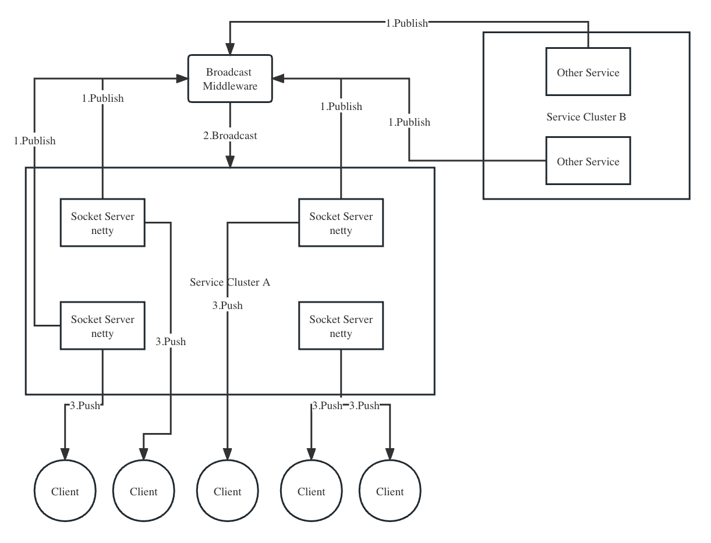

# Socket Holder

Socket Holder是一个socket管理框架，核心功能包括socket管理、业务订阅、服务集群广播。



[English](README.md)

## 快速开始

1. 引入依赖

```xml

<dependency>
    <groupId>com.isthisone</groupId>
    <artifactId>socket-holder-starter</artifactId>
    <version>1.0.0</version>
</dependency>
```

2. 配置websocket信息

```yml
#spring-boot3
spring:
  data:
    redis:
      host: 127.0.0.1
      port: 6379
      password: 123456

socket-holder:
  port: 8081
  path: '/ws'
```

或者

```yaml 
#spring-boot2或更早版本
spring:
  redis:
    host: 127.0.0.1
    port: 6379
    password: 123456
socket-holder:
  port: 8081
  path: '/ws'
``` 

3. 加上`@EnableSocketHolder`注解

```text
@Configuration
@EnableSocketHolder
public class SocketHolderConfiguration {
}
```

4. 创建Websocket处理类

```java

@Component
@RequiredArgsConstructor
@Slf4j
public class MyWebsocketHandler implements WebsocketHandler {

    private final DefaultSocketNotify defaultSocketNotify;

    @Override
    public void process(HolderChannel channel, String text) {
        log.info("id-{},text-{}", channel.getId(), text);
        defaultSocketNotify.subscribe("key", channel);
    }
}
```

5. 使用client发布消息

```java

@Component
@RequiredArgsConstructor
public class Tester() {

    private final SocketHolderClient socketHolderClient;

    public void test() {
        socketHolderClient.broadcast("Hello!");
    }
}
```

6. 创建redis广播监听类

```java

@EnableSocketHolder
@RequiredArgsConstructor
@Component
public class MyRedisBroadcastListener extends RedisBroadcastListener {

    private static final Logger logger = LoggerFactory.getLogger(MyRedisBroadcastListener.class);

    private final DefaultSocketNotify defaultSocketNotify;

    @Override
    public void listen(String topic, String msg) {
        logger.info("topic-{},msg-{}", topic, msg);
        defaultSocketNotify.notify("key", msg);
    }
}
```


